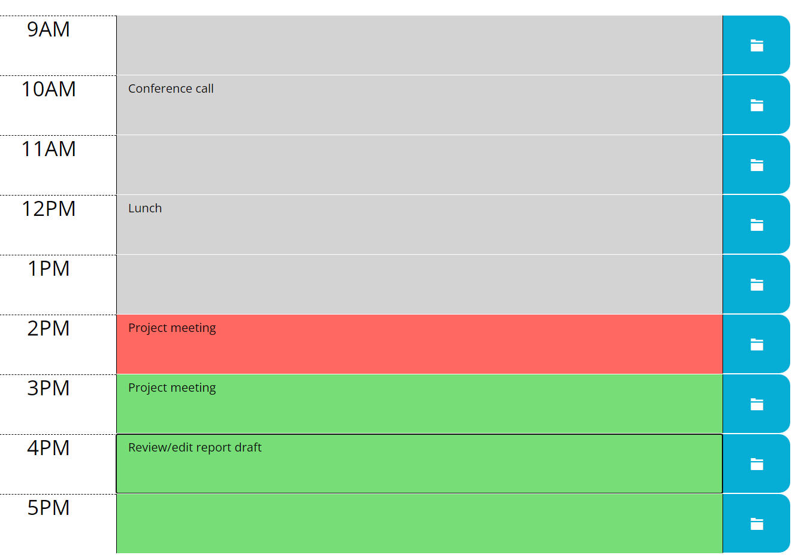

# Pencil-It-In Scheduler

A simple browser-based day planner, where you can add notes for each hour of the work day. Notes can be saved and edited. The date displayed adjusts to the current date, and background color of each hour block changes when ahead of, during, or past current time.

https://strudelandcoffee.github.io/pencil-it-in-scheduler/

This application was created in 1 week as a weekly challenge for the University of Texas Code Boot Camp, utilizing third-party APIs, including Bootstrap and Moment.js. Starter HTML and CSS code was provided by the University of Texas, except where otherwise stated. All JavaScript was developed by Stephen Trudell per the assignment requirements.

## UT Code Boot Camp - Week 5 Challenge Description:

Create a simple calendar application that allows the user to save events for each hour of the day. This app will run in the browser and feature dynamically updated HTML and CSS powered by jQuery.

## User Story

```
AS AN employee with a busy schedule
I WANT to add important events to a daily planner
SO THAT I can manage my time effectively
```

## Acceptance Criteria

```
GIVEN I am using a daily planner to create a schedule
WHEN I open the planner
    THEN the current day is displayed at the top of the calendar
WHEN I scroll down
    THEN I am presented with timeblocks for standard business hours
WHEN I view the timeblocks for that day
    THEN each timeblock is color coded to indicate whether it is in the past, present, or future
WHEN I click into a timeblock
    THEN I can enter an event
WHEN I click the save button for that timeblock
    THEN the text for that event is saved in local storage
WHEN I refresh the page
    THEN the saved events persist
```

The following picture demonstrates the application UI:

